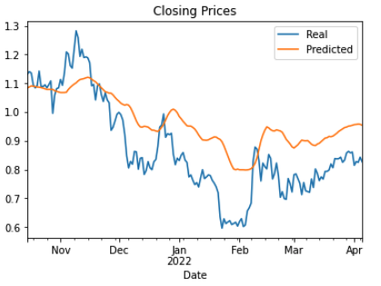

# Miami FinTech Bootcamp
## Project #2 

## Team Members:
    *Fabrice Salomon
    *Anthony Segovia
    *Josina Baiao
    *Clif Charles

# Background

Often, investers will use third party companies to provide financial information and advice for their investment desicions. This is definately the case when it comes to the Crypto Space, as there is a lot of unkown and investers may be new to this new asset class. We plan to build to following items in order to provide our investment advice within the Crypto Space:
1. Build a price predictive model that will provide an invester with the future price action of a particular crypto. For purposes of this project, we used Ripple (XRP) for our sample crypto for analysis.
2. Build indicators which will allow us to understand entry and exit points and convey this advice to our investment clients.

# Project Goals
## Cryptocurrency Price Prediction using Machine Learning and Python
    1. We will compare several machine learning models for predicting stock prices for a given crypto currency. We will use past data to predict price for several days into the future.
        a. We will use yfinance to pull past ticker information
    2. We also will use a variety of indicators as features to predict future pricing such as MACD, Bollinger Bands and Rolling Averages.
    3. Prepare a 10-15 minute presentation that demonstrates how machine learning can be used to solve problems in FinTech.

- - -

## Files

The following Jupyter Notebooks were used to build the Price Prediction Models and Indicators. 

Note: The notebooks show the final models used for the project, however, multiple features and variables were used to determine which models had the best performance.

[Time-Series ARIMA & GARCH](Code_Files/Crypto_TimeSeries_Forecasting.ipynb)

[Linear Regression Starter Notebook](Code_Files/Crytpo_AutoTS_Forecasting.ipynb)

[Yen Data CSV File](Code_Files/Crytpo_LSTM_Forecasting.ipynb)

- - -

## Code Execution - Build Price Predictor and Indicators

### Time-Series Forecasting
1. ARIMA  - Used historical day close data pulled from Yahoo Finance, applied time series analysis and modeling to determin if there is a predictable behavior.
    a. Pulled in data, created a dataframe and ploted Date, Open, High, Low, Close, Adj Close, Volume.
    b. Trimmed data to September of 2020, and wrangled df in preperation for model.
    c. Imported ARIMA model fit it to the data.
    d. Output the results using arima_results.summary() and ploted. Determined the model was not confident in its predictions as the AIC & BIC were not very low at -1374.206 and the P factor was well above a confident score of 0.05 at a range of .238 to .773.
2. GARCH  - as a supplament of predicting price, we forecast near-term **volatility** of future Crypto price action. Being able to accurately predict volatility will be extremely useful if we want to provide investment advice for investers that trade in derivatives or quantify our maximum loss.
    a. imported arch model
    b. We developed a GARCH model and fit it to the close data. Note: Setting parameters to p=2 and q=1: order=(2, 1).
    c. Output the GARCH summary table and take note of the p-values of the lags. Based on the p-values, is the model a good fit (p < 0.05)?
        > alpha[1] was a .0575, which is good confidence in the model
        > however, the AIC & BIC were high at 3585
    d. Plot the 5-day forecast of the volatility
3. LSTM - In this notebook, we build and train a custom LSTM RNN that uses a 7 day window of XRP closing prices to predict the 11th day closing price. 
    a. Prepare the data for training and testing
        > Create a function that accepts the column number for the features (X) and the target (y)
        > defined X and y and determine feature and target column
        > split data into train and test sets for both X and y
        > used MinMaxScaler to scale data and then reshaped the features for the model
    b. Build and train a custom LSTM RNN
        > import tensorflow.keras.models for LSTM
        > set "model" variable to my Sequential() and used three Layers plus Output
        > compiled the model and summarized the model using model.summary()
        > Trained the data through 10 Epics with loss at 0.0128 at #10
    c. Evaluate the performance of the model
        > the y_test predictions had a loss of .0055
        > performed our prediction, recovered the original prices by using inverse_transform, and created a dataframe with Real and Predicted colums
        > Ploted Real against Predicted results
        
4. autoTS - AutoTS is a time series package for Python designed for rapidly deploying high-accuracy forecasts at scale. We used autoTS to predict a 10 day forecast of XRP.
    a. inport AutoTS and pull in data from yfinance and plot data
    b. set autoTS model
        > use 10 day forecast length and fropped data older than 200 periods
        > fit the model to the data and run
        > predict the model and forecast 10 days - print results
        > plot predictions
    c. Check performance and accuracy of model with model.results and "validation" data.
        
# Summary - Investment Recommendations

